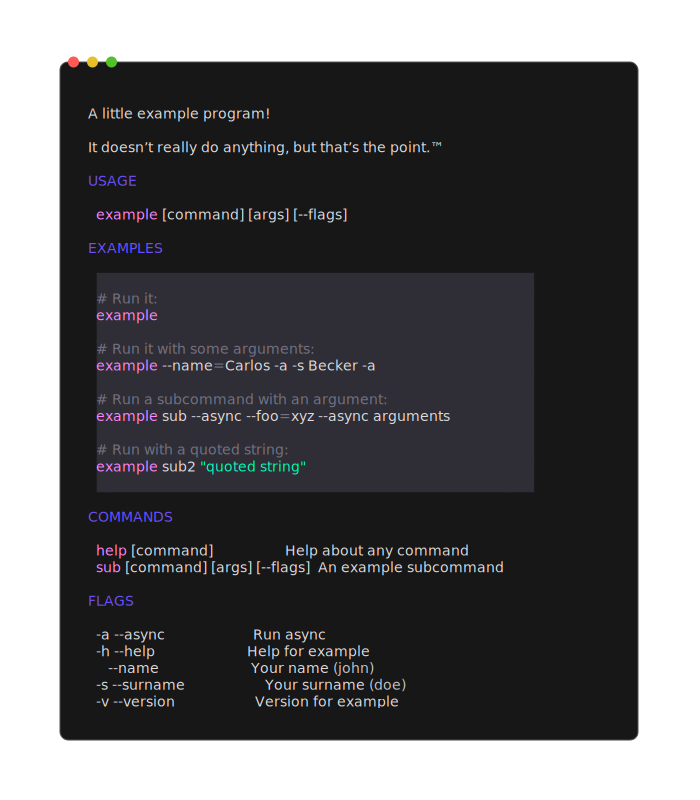
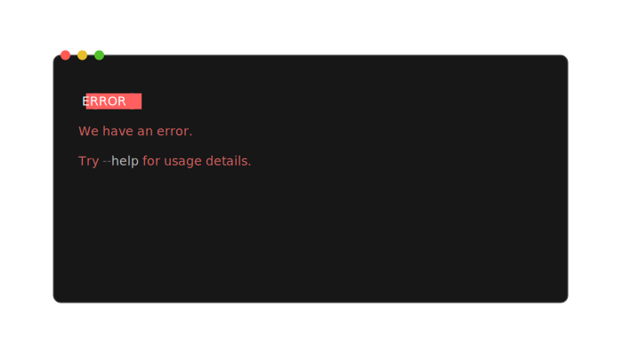

# Fang

An experimental small library to make user friendly [cobra][] commands.



<p>
  
</p>

## Features

- Beautiful help pages: styled help and usage pages
- Automatic `--version`: set it to the [build info][info], or a provided version
- Man pages: adds a hidden `man` command to generate _manpages_ using
  [mango][][^1]
- Completions: adds a `completion` command that generate shell completions
- Silence usage (don't show the help after an user error)
- Beautiful error handling

[info]: https://pkg.go.dev/runtime/debug#BuildInfo
[cobra]: https://github.com/spf13/cobra
[mango]: https://github.com/muesli/mango

[^1]:
    Default cobra man pages generates one man page for each command. This is
    generally fine for programs with a lot of sub commands, like git, but its an
    overkill for smaller programs.
    Mango also uses _roff_ directly instead of converting from markdown, so it
    should render better looking man pages.

## Usage

To use it, invoke `fang.Execute` passing your root `*cobra.Command`:

```go
package main

import (
	"os"

	"github.com/charmbracelet/fang"
	"github.com/spf13/cobra"
)

func main() {
	cmd := &cobra.Command{
		Use:   "example",
		Short: "A simple example program!",
	}
	if err := fang.Execute(context.TODO(), cmd); err != nil {
		os.Exit(1)
	}
}
```

That's all there is to it!

## Feedback

We’d love to hear your thoughts on this project. Feel free to drop us a note!

- [Twitter](https://twitter.com/charmcli)
- [The Fediverse](https://mastodon.social/@charmcli)
- [Discord](https://charm.sh/chat)

## License

[MIT](https://github.com/charmbracelet/gum/raw/main/LICENSE)

---

Part of [Charm](https://charm.sh).

<a href="https://charm.sh/"></a>

Charm热爱开源 • Charm loves open source
